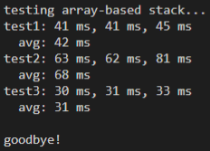
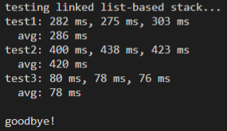

# Практическая работа 2
## Сравнение скорости работы динамического массива и односвязного списка

Проведено исследование скорости работы двух реализаций стэка.
реализация №1: стэк на основе динамического массива
реализация №2: стэк на основе связного списка
файлы, относящиеся к реализации №2 содержат в своем названии суффикс ll (от linked list)

### Результаты тестирования стэка на динамическом массиве:

### Результаты тестирования стэка на связном списке:

### Вывод.
Стэк на основе связного списка значитльно уступает стэку на динамическом массиве во всех тестах.  
Это можно обьяснить его плохой пространственной локальностью по сравнению с другой реализацией.  
В тесте №3 он демонстрирует лучшие результаты, так как время добавления миллиона первых элементов не засекается.